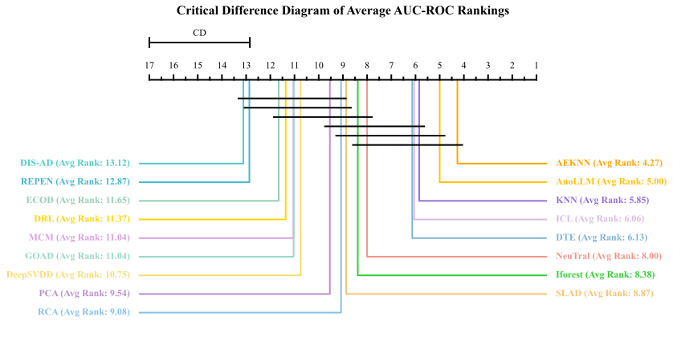
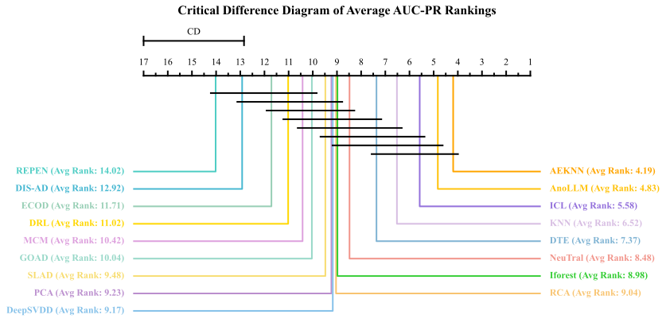
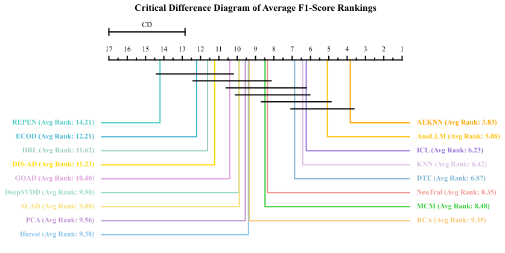

# AEKNN

Official code of submission "Less is More: Rethinking Unsupervised Anomaly Detection from Autoencoder-based Perspective"

# Contents in each folder

data: Datasets used for training and evaluating

DIS-AD： DIS-AD official code after correction. Run main.py to reimplement.

DRL: DRL official code after correction. Run main.py to reimplement.

MCM: MCM official code after correction. Run main.py to reimplement.

logs: Training and Evaluating logs for each dataset.

Others: AEKNN official code. Run main.py to reimplement.

# Datasets

We conduct experiments on 25 benchmark datasets derived from the Outlier Detection DataSets (ODDS) repository, covering diverse domains such as forensic science, network intrusion, image processing, and linguistics. 

| Number |     Data     | # Samples | # Features |  # Anomaly   | % Anomaly |   Category   |
|:------:|:------------:|:---------:|:----------:|:------------:|:---------:|:------------:|
|   1    |  Annthyroid  |   7200    |     6      |     534      |   7.42    |  Healthcare  |
|   2    |  Arrhythmia  |    452    |    274     |      66      |   14.60   |  Healthcare  |
|   3    |   BreastW    |    683    |     9      |     239      |   34.99   |  Healthcare  |
|   4    |    Cardio    |   1831    |     21     |     176      |   9.61    |  Healthcare  |        
|   5    | Forestcover  |  286048   |     10     |     2747     |   0.96    |    Botany    | 
|   6    |    Glass     |    214    |     7      |      9       |   4.21    |   Forensic   |
|   7    |  Ionosphere  |    351    |     32     |     126      |   35.90   | Oryctognosy  |
|   8    |    Letter    |   1600    |     32     |     100      |   6.25    |    Image     |    
|   9    | Lymphography |    148    |     18     |      6       |   4.05    |  Healthcare  |  
|   10   | Mammography  |   11183   |     6      |     260      |   2.32    |  Healthcare  |       
|   11   |   Mulcross   |  262144   |     4      |    26214     |   10.00   |  Healthcare  |      
|   12   |     Musk     |   3062    |    166     |      97      |   3.17    |  Chemistry   |      
|   13   |  Optdigits   |   5216    |     64     |     150      |   2.88    |    Image     |
|   14   |  Pendigits   |   6870    |     16     |     156      |   2.27    |    Image     | 
|   15   |     Pima     |    768    |     8      |     268      |   34.90   |  Healthcare  |
|   16   |  Satellite   |   6435    |     36     |     2036     |   31.64   | Astronautics |    
|   17   |  Satimage-2  |   5803    |     36     |      71      |   1.22    | Astronautics |     
|   18   |   Shuttle    |   49097   |     9      |     3511     |   7.15    | Astronautics |       
|   19   |     Smtp     |   95156   |     3      |      30      |   0.03    |   Security   | 
|   20   |    Speech    |   3686    |    400     |      61      |   1.65    | Linguistics  |     
|   21   |   Thyroid    |   3772    |     6      |      93      |   2.47    |  Healthcare  |   
|   22   |  Vertebral   |    240    |     6      |      30      |   12.50   |   Biology    |  
|   23   |    Vowels    |   1456    |     12     |      50      |   3.43    | Linguistics  |       
|   24   |     WBC      |    223    |     9      |      10      |   4.48    |  Healthcare  |
|   25   |     Wine     |    129    |     13     |      10      |   7.75    |  Chemistry   |      

# Baselines

We follow the baselines of AnoLLM except from MCM, DIS-AD and DRL. Specifically, data leaks occurred in the official code for MCM and DRL. In extreme cases, normal samples in the training and test sets could be identical. DIS-AD uses different hyperparameters for different datasets, violating the experimental setup for unsupervised anomaly detection.  We have fixed issues in the official code and the corrected code and experimental data are available in the repository.

# AUC-ROC Results

| Datasets\Methods | Iforest |   PCA   |   KNN   |   ECOD  | DeepSVDD |   RCA   |   SLAD  |   GOAD  | NeuTral |   ICL   |   DTE   |  REPEN  |  AnoLLM |   MCM   |  DIS-AD |   DRL   |  AEKNN  |
|:----------------:|:-------:|:-------:|:-------:|:-------:|:--------:|:-------:|:-------:|:-------:|:-------:|:-------:|:-------:|:-------:|:-------:|:-------:|:-------:|:-------:|:-------:|
|    Annthyroid    |  0.922  |  0.839  |  0.811  |   0.79  |   0.742  |  0.718  |  0.761  |  0.572  |  0.813  |  0.842  |  0.977  |  0.736  |  0.927  |  0.8357 |  0.7203 |  0.6285 |  0.8936 |
|    Arrhythmia    |  0.827  |  0.796  |  0.786  |  0.811  |   0.765  |  0.786  |  0.784  |  0.681  |   0.76  |  0.785  |  0.771  |  0.684  |  0.825  |  0.7279 |  0.7716 |  0.7454 |  0.8235 |
|      BreastW     |  0.994  |  0.988  |  0.992  |  0.992  |   0.974  |  0.987  |  0.986  |  0.994  |  0.983  |  0.992  |  0.982  |  0.955  |  0.992  |  0.9855 |  0.9943 |  0.9445 |  0.9889 |
|      Cardio      |  0.948  |  0.966  |  0.921  |  0.935  |   0.842  |  0.948  |   0.84  |  0.524  |  0.859  |  0.894  |   0.92  |  0.829  |   0.94  |  0.8473 |  0.5258 |  0.8945 |  0.9596 |
|    ForestCover   |   0.87  |  0.945  |  0.985  |  0.921  |   0.533  |  0.944  |  0.857  |  0.278  |  0.898  |  0.977  |  0.978  |  0.902  |  0.881  |  0.9606 |  0.6371 |  0.6286 |   0.99  |
|       Glass      |  0.802  |  0.713  |  0.849  |  0.693  |   0.824  |  0.719  |   0.79  |  0.574  |  0.933  |  0.887  |  0.799  |  0.755  |  0.819  |  0.6438 |  0.8948 |  0.7773 |  0.8921 |
|    Ionosphere    |  0.891  |  0.894  |   0.96  |  0.734  |   0.963  |  0.916  |   0.96  |   0.95  |  0.956  |   0.97  |  0.964  |  0.545  |  0.909  |  0.6674 |  0.5279 |  0.9656 |  0.9673 |
|      Letter      |  0.631  |  0.529  |  0.865  |  0.567  |   0.776  |  0.716  |  0.908  |  0.811  |  0.929  |  0.959  |  0.872  |  0.597  |  0.967  |  0.5533 |  0.4398 |  0.653  |  0.922  |
|   Lymphography   |  0.673  |  0.826  |   0.86  |   0.83  |   0.899  |  0.919  |  0.964  |  0.817  |  0.847  |  0.827  |  0.909  |  0.808  |  0.968  |  0.9845 |  0.2069 |  0.9765 |  0.9577 |
|    Mammography   |  0.881  |   0.9   |  0.872  |  0.906  |   0.857  |  0.873  |   0.74  |  0.756  |   0.69  |  0.782  |  0.864  |  0.863  |  0.915  |  0.8601 |  0.6288 |  0.5463 |  0.8959 |
|     Mulcross     |  0.999  |    1    |    1    |   0.96  |     1    |    1    |  0.969  |    1    |  0.968  |    1    |    1    |  0.973  |    1    |  0.9986 |  0.5144 |  0.9999 |    1    |
|       Musk       |  0.971  |    1    |    1    |  0.956  |     1    |    1    |    1    |    1    |    1    |    1    |    1    |  0.722  |    1    |  0.9999 |  0.9131 |    1    |    1    |
|     Optdigits    |  0.824  |  0.574  |  0.944  |  0.606  |   0.753  |   0.8   |  0.735  |  0.847  |  0.979  |  0.955  |  0.888  |  0.607  |  0.983  |  0.5762 |  0.5819 |  0.6133 |  0.9774 |
|     Pendigits    |  0.971  |  0.942  |  0.999  |  0.928  |   0.838  |  0.967  |  0.932  |   0.22  |  0.963  |  0.971  |  0.982  |  0.922  |  0.971  |  0.727  |  0.3786 |  0.8524 |  0.9984 |
|       Pima       |   0.72  |  0.711  |  0.741  |  0.587  |   0.593  |  0.704  |  0.584  |  0.665  |  0.763  |  0.697  |  0.662  |  0.688  |  0.663  |  0.7314 |  0.4178 |  0.6641 |  0.7145 |
|     Satellite    |  0.807  |  0.662  |  0.874  |  0.582  |    0.8   |  0.734  |  0.864  |  0.795  |  0.859  |  0.854  |  0.789  |   0.74  |  0.902  |  0.558  |  0.5474 |  0.7571 |  0.8523 |
|    Satimage-2    |  0.993  |  0.979  |  0.999  |  0.965  |   0.961  |  0.998  |  0.997  |  0.994  |  0.861  |  0.997  |  0.988  |  0.998  |    1    |  0.6602 |  0.7897 |  0.8814 |  0.9988 |
|      Shuttle     |  0.996  |  0.994  |  0.999  |  0.993  |   0.997  |  0.996  |  0.998  |   0.99  |  0.997  |  0.999  |  0.998  |  0.992  |    1    |  0.9945 |  0.9811 |  0.9874 |  0.9996 |
|       Smtp       |  0.905  |  0.809  |  0.936  |   0.88  |   0.78   |  0.845  |  0.926  |  0.911  |   0.89  |  0.885  |  0.953  |  0.894  |  0.927  |  0.8974 |  0.7849 |  0.8627 |  0.9177 |
|      Speech      |  0.478  |  0.471  |  0.486  |  0.471  |   0.563  |  0.472  |  0.511  |   0.55  |  0.609  |  0.582  |  0.511  |  0.531  |   0.47  |  0.4707 |  0.533  |  0.4957 |  0.5315 |
|      Thyroid     |  0.989  |  0.984  |  0.976  |  0.978  |   0.869  |  0.969  |  0.948  |  0.689  |  0.886  |  0.987  |   0.99  |  0.904  |  0.975  |  0.9594 |  0.9697 |  0.9234 |  0.9728 |
|     Vertebral    |  0.446  |  0.494  |  0.406  |  0.474  |   0.478  |  0.478  |  0.483  |  0.516  |  0.545  |  0.543  |   0.57  |  0.247  |  0.565  |  0.4895 |  0.5436 |  0.407  |  0.4483 |
|      Vowels      |  0.779  |  0.644  |  0.975  |  0.597  |   0.895  |  0.891  |  0.969  |  0.925  |  0.988  |  0.979  |  0.983  |  0.753  |  0.982  |  0.825  |  0.4407 |  0.8889 |  0.979  |
|        WBC       |  0.947  |  0.949  |  0.947  |  0.907  |   0.904  |  0.946  |  0.928  |  0.663  |  0.765  |  0.908  |  0.913  |   0.77  |  0.964  |  0.9789 |  0.5102 |  0.9533 |  0.9544 |
|       Wine       |   0.93  |  0.927  |  0.952  |  0.729  |   0.854  |  0.899  |  0.964  |  0.961  |   0.96  |  0.944  |  0.974  |  0.835  |  0.909  |  0.9527 |  0.9997 |  0.9457 |  0.9777 |
|      Average     | 0.8478  | 0.8214  | 0.8854  | 0.7917  |  0.8184  | 0.8490  | 0.8559  | 0.7473  | 0.8680  | 0.8886  | 0.8895  | 0.7700  | 0.8982  | 0.7954  | 0.6501  | 0.7997  | 0.9045  |

# AUC-PR Results 

We update the results of DIS-AD.

| Datasets\Methods | Iforest |   PCA   |   KNN   |   ECOD  | DeepSVDD |   RCA   |   SLAD  |   GOAD  | NeuTral |   ICL   |   DTE   |  REPEN  |  AnoLLM |   MCM   | DIS-AD |   DRL   |  AEKNN  |
|:----------------:|:-------:|:-------:|:-------:|:-------:|:--------:|:-------:|:-------:|:-------:|:-------:|:-------:|:-------:|:-------:|:-------:|:-------:|:------:|:-------:|:-------:|
|    Annthyroid    |  0.646  |   0.55  |  0.463  |  0.406  |   0.441  |  0.383  |  0.461  |  0.286  |  0.435  |  0.555  |  0.835  |  0.343  |  0.631  |  0.5266 | 0.2674 |  0.2993 |  0.5828 |
|    Arrhythmia    |  0.662  |  0.617  |  0.556  |  0.622  |   0.563  |  0.562  |  0.556  |  0.518  |  0.507  |  0.556  |  0.566  |  0.419  |  0.636  |  0.5574 | 0.5734 |  0.5295 |  0.5823 |
|      BreastW     |  0.994  |  0.985  |  0.992  |  0.992  |   0.966  |  0.986  |  0.983  |  0.994  |   0.97  |  0.991  |  0.967  |  0.925  |  0.991  |  0.9803 | 0.9948 |  0.9291 |  0.9866 |
|      Cardio      |  0.786  |  0.844  |  0.737  |  0.712  |   0.606  |  0.745  |  0.667  |  0.325  |   0.61  |   0.75  |  0.678  |  0.567  |  0.811  |  0.607  | 0.1751 |  0.7171 |  0.8452 |
|    ForestCover   |  0.649  |   0.71  |  0.786  |  0.306  |   0.621  |  0.739  |  0.728  |  0.796  |  0.475  |  0.807  |  0.583  |  0.682  |  0.419  |  0.6419 | 0.1221 |  0.0302 |  0.8564 |
|       Glass      |  0.198  |  0.167  |  0.242  |  0.242  |   0.263  |  0.187  |  0.208  |   0.15  |  0.484  |  0.374  |  0.226  |  0.165  |  0.247  |  0.1981 | 0.4797 |  0.2893 |  0.3725 |
|    Ionosphere    |  0.898  |  0.912  |  0.967  |  0.769  |   0.967  |  0.932  |  0.969  |  0.958  |  0.959  |  0.977  |  0.972  |  0.534  |  0.933  |  0.7622 | 0.6274 |  0.9729 |  0.9746 |
|      Letter      |  0.168  |  0.143  |  0.426  |  0.141  |   0.412  |  0.259  |  0.578  |   0.39  |  0.703  |  0.773  |   0.55  |  0.151  |  0.797  |  0.1736 | 0.0989 |  0.2522 |  0.6255 |
|   Lymphography   |  0.232  |  0.624  |   0.72  |  0.365  |   0.68   |  0.783  |  0.795  |  0.697  |  0.681  |  0.718  |  0.747  |  0.697  |  0.856  |  0.8626 | 0.0561 |  0.8635 |  0.8027 |
|    Mammography   |  0.392  |  0.443  |  0.399  |  0.548  |   0.447  |  0.312  |  0.126  |  0.232  |  0.094  |  0.287  |  0.378  |  0.268  |  0.592  |  0.3657 | 0.0589 |  0.0618 |  0.4535 |
|     Mulcross     |  0.989  |    1    |    1    |  0.722  |     1    |    1    |  0.788  |    1    |  0.816  |  0.998  |    1    |  0.782  |    1    |  0.9909 | 0.1984 |  0.9991 |    1    |
|       Musk       |  0.666  |    1    |    1    |  0.627  |     1    |    1    |    1    |    1    |    1    |    1    |    1    |  0.175  |    1    |  0.9969 | 0.4341 |    1    |    1    |
|     Optdigits    |  0.166  |  0.059  |  0.314  |  0.065  |   0.232  |  0.122  |  0.109  |  0.178  |  0.645  |  0.414  |  0.222  |  0.076  |   0.75  |  0.0753 | 0.0699 |  0.0714 |  0.6003 |
|     Pendigits    |  0.544  |  0.376  |  0.958  |  0.395  |   0.416  |  0.516  |  0.292  |  0.026  |  0.408  |  0.656  |  0.509  |  0.319  |  0.623  |  0.1987 | 0.0336 |  0.3776 |  0.948  |
|       Pima       |  0.714  |  0.696  |  0.716  |  0.622  |   0.606  |  0.698  |  0.603  |   0.66  |  0.746  |  0.695  |  0.639  |  0.673  |  0.677  |  0.6999 | 0.451  |  0.6686 |  0.6985 |
|     Satellite    |  0.845  |  0.769  |  0.889  |  0.658  |   0.842  |  0.806  |  0.866  |  0.808  |   0.86  |  0.887  |  0.843  |  0.806  |   0.91  |  0.5937 | 0.5985 |  0.8199 |  0.8811 |
|    Satimage-2    |   0.93  |  0.901  |   0.98  |  0.745  |   0.905  |  0.977  |  0.903  |   0.98  |  0.082  |  0.967  |  0.526  |  0.952  |  0.988  |  0.0349 | 0.3107 |  0.3016 |  0.9671 |
|      Shuttle     |  0.984  |  0.962  |  0.972  |  0.946  |   0.987  |   0.96  |  0.968  |  0.949  |  0.994  |  0.995  |  0.946  |  0.928  |  0.997  |  0.9801 | 0.8436 |  0.9808 |  0.9948 |
|       Smtp       |   0.01  |  0.454  |  0.459  |  0.608  |   0.058  |  0.441  |  0.469  |  0.441  |  0.582  |  0.377  |  0.467  |  0.403  |  0.658  |  0.6679 | 0.271  |  0.1879 |  0.6335 |
|      Speech      |  0.035  |  0.037  |  0.038  |   0.04  |   0.042  |  0.037  |  0.036  |   0.04  |  0.052  |  0.057  |   0.04  |  0.035  |  0.036  |  0.034  | 0.0417 |  0.037  |  0.0426 |
|      Thyroid     |  0.783  |  0.791  |  0.696  |  0.635  |   0.56   |  0.649  |  0.686  |  0.401  |   0.33  |  0.822  |   0.86  |  0.385  |  0.696  |  0.7214 | 0.7899 |  0.5327 |  0.7036 |
|     Vertebral    |   0.21  |  0.232  |  0.192  |  0.228  |   0.252  |  0.214  |   0.21  |  0.281  |  0.303  |  0.264  |   0.31  |  0.151  |  0.289  |  0.2236 | 0.2354 |  0.1914 |  0.2117 |
|      Vowels      |  0.229  |  0.162  |  0.762  |  0.153  |   0.603  |  0.455  |  0.765  |  0.544  |  0.861  |  0.804  |  0.831  |  0.203  |  0.839  |  0.4052 | 0.0712 |  0.3458 |  0.8312 |
|        WBC       |  0.842  |  0.876  |  0.814  |  0.586  |   0.747  |  0.808  |  0.711  |  0.408  |  0.226  |  0.714  |   0.64  |  0.235  |  0.873  |  0.8732 | 0.1419 |  0.7739 |  0.7671 |
|       Wine       |  0.672  |  0.659  |  0.711  |  0.321  |   0.512  |  0.517  |  0.782  |  0.789  |  0.779  |  0.734  |  0.873  |  0.484  |  0.522  |  0.667  | 0.9982 |  0.725  |  0.8516 |
|      Average     | 0.5698  | 0.5988  | 0.6716  | 0.4982  |  0.5891  | 0.6035  | 0.6104  | 0.5540  | 0.5841  | 0.6869  | 0.6483  | 0.4543  | 0.7108  | 0.5535  | 0.3577 | 0.5183  | 0.7285  |

# F1-Score Results
| Datasets\Methods | Iforest |   PCA   |   KNN   |   ECOD  | DeepSVDD |   RCA   |   SLAD  |   GOAD  | NeuTral |   ICL   |   DTE   |  REPEN  |  AnoLLM |   MCM   |  DIS-AD |   DRL   |  AEKNN  |
|:----------------:|:-------:|:-------:|:-------:|:-------:|:--------:|:-------:|:-------:|:-------:|:-------:|:-------:|:-------:|:-------:|:-------:|:-------:|:-------:|:-------:|:-------:|
|    Annthyroid    |  0.574  |  0.487  |   0.44  |  0.388  |   0.436  |  0.367  |  0.418  |  0.257  |  0.468  |  0.501  |  0.789  |  0.338  |  0.584  |  0.4885 |  0.3912 |  0.3052 |  0.5461 |
|    Arrhythmia    |  0.612  |  0.542  |  0.554  |  0.591  |   0.533  |  0.542  |  0.536  |  0.503  |  0.515  |  0.533  |  0.521  |  0.452  |  0.612  |  0.5344 |  0.5774 |  0.5061 |  0.629  |
|      BreastW     |  0.969  |  0.959  |  0.963  |  0.954  |   0.936  |  0.959  |  0.951  |  0.966  |  0.967  |  0.959  |  0.963  |  0.935  |  0.958  |  0.9604 |  0.9665 |  0.8728 |  0.9657 |
|      Cardio      |  0.715  |  0.808  |  0.676  |  0.666  |   0.564  |  0.726  |  0.602  |  0.294  |  0.568  |  0.689  |  0.644  |  0.561  |  0.734  |  0.5665 |  0.3096 |  0.6398 |  0.7805 |
|    ForestCover   |  0.109  |  0.158  |  0.745  |  0.238  |   0.035  |  0.189  |  0.136  |  0.001  |  0.426  |  0.769  |  0.778  |  0.064  |  0.256  |  0.6581 |  0.2133 |  0.0481 |  0.8408 |
|       Glass      |  0.156  |  0.133  |  0.178  |  0.156  |   0.244  |  0.156  |  0.178  |  0.133  |  0.422  |  0.289  |  0.133  |  0.067  |  0.178  |  0.2813 |  0.4835 |  0.2222 |  0.5094 |
|    Ionosphere    |  0.797  |  0.789  |  0.894  |   0.66  |   0.895  |  0.832  |  0.894  |  0.854  |  0.882  |  0.906  |   0.9   |  0.595  |  0.821  |  0.7032 |  0.6851 |  0.9111 |  0.9128 |
|      Letter      |  0.176  |  0.136  |  0.434  |  0.146  |   0.404  |   0.29  |  0.548  |  0.404  |  0.636  |  0.722  |  0.588  |  0.164  |  0.734  |  0.2247 |  0.2116 |  0.226  |  0.6101 |
|   Lymphography   |  0.233  |  0.567  |  0.667  |   0.4   |   0.567  |  0.667  |  0.667  |  0.667  |  0.633  |  0.667  |  0.667  |  0.667  |  0.767  |  0.8643 |  0.1372 |  0.7667 |  0.7855 |
|    Mammography   |  0.413  |  0.474  |  0.409  |  0.535  |   0.443  |  0.358  |  0.138  |  0.287  |  0.135  |  0.298  |  0.364  |  0.294  |  0.551  |  0.3681 |  0.1258 |  0.0656 |  0.4476 |
|     Mulcross     |  0.995  |    1    |    1    |  0.747  |     1    |  0.999  |   0.76  |    1    |  0.852  |  0.996  |    1    |  0.816  |    1    |  0.9865 |  0.3661 |  0.9971 |    1    |
|       Musk       |  0.616  |    1    |    1    |  0.546  |     1    |    1    |    1    |    1    |    1    |    1    |    1    |   0.15  |    1    |  0.9865 |  0.5204 |    1    |  0.9948 |
|     Optdigits    |  0.159  |  0.001  |  0.284  |  0.027  |   0.297  |  0.021  |   0.04  |  0.165  |  0.639  |  0.471  |  0.164  |   0.02  |   0.72  |  0.1607 |  0.1397 |  0.0667 |  0.7036 |
|     Pendigits    |  0.551  |  0.442  |   0.91  |  0.427  |   0.445  |   0.53  |  0.356  |    0    |  0.467  |   0.61  |  0.606  |  0.373  |  0.559  |  0.2706 |  0.0851 |  0.3833 |  0.9162 |
|       Pima       |  0.672  |  0.688  |  0.692  |  0.578  |   0.57   |  0.672  |  0.585  |  0.628  |  0.695  |   0.67  |  0.624  |  0.668  |  0.626  |  0.7421 |  0.684  |  0.6373 |  0.719  |
|     Satellite    |  0.696  |  0.614  |  0.762  |  0.538  |   0.71   |  0.685  |   0.76  |  0.693  |  0.751  |  0.757  |  0.723  |  0.691  |  0.798  |  0.6603 |  0.6493 |  0.6774 |  0.7782 |
|    Satimage-2    |  0.873  |  0.848  |  0.935  |  0.718  |   0.884  |  0.949  |  0.825  |  0.955  |  0.051  |  0.918  |  0.501  |  0.916  |  0.952  |  0.0795 |  0.3696 |  0.2704 |  0.8962 |
|      Shuttle     |  0.964  |  0.958  |  0.977  |  0.917  |   0.983  |  0.969  |  0.975  |  0.965  |  0.982  |  0.983  |  0.974  |  0.936  |  0.983  |  0.9808 |  0.8471 |  0.9684 |  0.985  |
|       Smtp       |    0    |  0.667  |  0.667  |  0.667  |   0.093  |  0.653  |  0.667  |  0.667  |  0.607  |  0.493  |  0.667  |  0.607  |  0.667  |  0.0783 |  0.0564 |  0.2933 |  0.0783 |
|      Speech      |   0.03  |  0.049  |  0.056  |  0.049  |   0.036  |  0.049  |  0.039  |  0.039  |  0.049  |  0.075  |  0.052  |  0.013  |  0.066  |  0.071  |  0.0832 |  0.023  |  0.0816 |
|      Thyroid     |  0.789  |  0.723  |  0.643  |  0.626  |   0.557  |   0.6   |  0.639  |  0.417  |   0.35  |  0.778  |  0.804  |  0.346  |  0.682  |  0.693  |  0.7459 |  0.4839 |  0.6701 |
|     Vertebral    |  0.187  |  0.207  |   0.14  |  0.213  |   0.28   |   0.16  |   0.16  |   0.3   |  0.327  |  0.193  |   0.3   |  0.013  |  0.287  |  0.4108 |  0.4166 |  0.1333 |  0.3719 |
|      Vowels      |  0.248  |   0.2   |  0.684  |   0.22  |   0.548  |  0.424  |  0.716  |   0.46  |  0.768  |   0.74  |   0.78  |  0.244  |   0.76  |  0.4212 |  0.126  |  0.368  |  0.7578 |
|        WBC       |  0.819  |   0.79  |  0.714  |  0.562  |   0.705  |  0.724  |  0.667  |  0.381  |  0.181  |  0.733  |  0.619  |  0.219  |   0.79  |  0.7903 |  0.2224 |  0.7429 |  0.7094 |
|       Wine       |   0.7   |   0.62  |   0.7   |   0.38  |   0.42   |   0.6   |   0.72  |   0.76  |   0.7   |   0.62  |   0.72  |   0.44  |   0.5   |  0.8077 |  0.9905 |   0.68  |  0.8656 |
|      Average     | 0.5221  | 0.5544  | 0.6450  | 0.4780  |  0.5434  | 0.5648  | 0.5591  | 0.5118  | 0.5628  | 0.6548  | 0.6352  | 0.4236  | 0.6634  | 0.5516  | 0.4161  | 0.4915  | 0.7022  |

# Visualization

